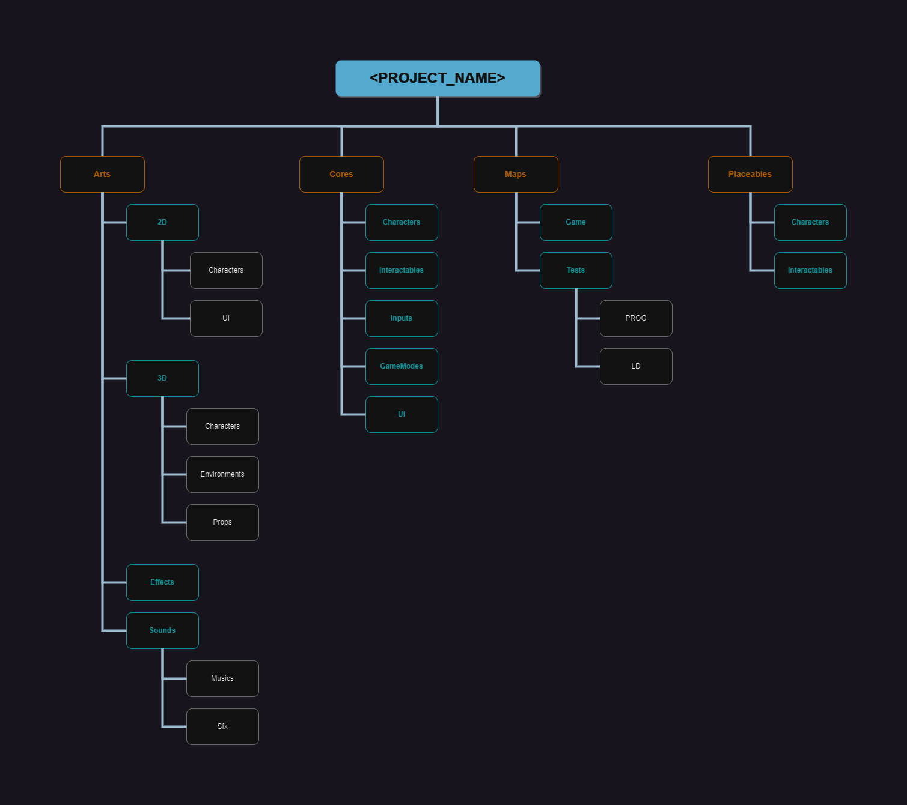

# Folder hierarchy
## Description
It's a folder hierarchy that I generally follow for intermediate project (1-3 months), because it's scale very well.  
In opposite to asset type hierarchy, we gather all assets in components folder. For instance, a character named "Mario" will have  
a folder in Arts that will contain 3D Models, animations, materials and textures concerning Mario.

Following such hierarchy allows to easily :
- add and remove a feature from the project.
- found any assets concerning a character or an object.

It's also sort by job type, so each person can concentrate on his own branch :
- Arts => Modeling
- Cores => Programming
- Placeables => Level design

We create a subfolder named by the project name under the Assets (Unity Engine) or Content folder (Unreal Engine) to separate plugins / externals
code to the real project code.

## Project Structure
### Schema

### More details
<PROJECT_NAME>
├── Arts                      # Arts elements (Materials, Textures, Models, Sounds...)
|    ├── 2D
|        ├── Characters
|        ├── UI
|            ├── Backgrounds
|            ├── Fonts
|            ├── Icons
|
|    ├── 3D
|        ├── Characters
|        ├── Environments
|            ├── Industrial
|            ├── Nature
|        ├── Props
|            ├── Furniture
|            ├── Structure
|
|    ├── Effects              # Utility materials / shaders (transparency...)
|    ├── Sounds
|        ├── Musics
|        ├── Sfx
|
├── Cores
|    ├── Characters
|    ├── Interactables
|    ├── Inputs
|    ├── GameModes
|    ├── UI
|
├── Maps
|    ├── Game                 # Level build in the shipping build
|    ├── Tests                # Level build only for testing and not present in shipping
|
├── Placeables                # All placeables items used by Level Designer
|    ├── Characters
|    ├── Interactables

## Credits
- [Style guide of Unreal Engine](https://github.com/Allar/ue5-style-guide#2e1-example-project-content-structure).
